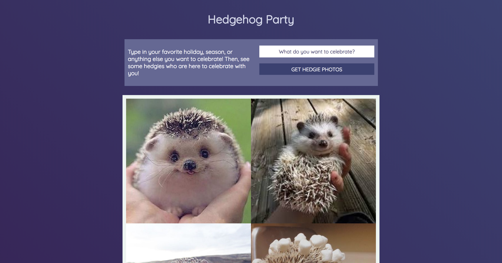

# Hedgehog Web Scraper

## Set Up

### Front End
- Go to [this link](https://github.com/ameseee/hedgehog-fe)
- Click "Fork" in the top right corner. This will create a copy of the project, but in your GitHub account.
- In your project, click the green "Clone or Download" button. Then, click the clipboard icon.
- Now, go into your terminal. Type `git clone `  and "control v". You should see something like: `git clone https://github.com/<your username>/hedgehog-fe.git`. Press enter.
- Type `cd hedgehog-fe`
- Type `open index.html`
- Your browser will open to a page that looks something like this:

- Keep your terminal open at all times!

### Web Scraper
- Go to [this link](https://github.com/<your username>/hedgehog-scraper)
- Click "Fork" in the top right corner. This will create a copy of the project, but in your GitHub account.
- In your project, click the green "Clone or Download" button. Then, click the clipboard icon.
- Back in your terminal, type "control", "alt", and "t" at the same time. A new window should open.
- Type `cd ..`. In this new window, follow this next set of directions.
- Now, go into your terminal. Type `git clone ` and "control v". You should see something like: `git clone https://github.com/<your username>/hedgehog-scraper.git`. Press enter.
- Type `cd hedgehog-scraper`
- Type `npm install`
- Type `npm start`
- You should see something like this in your terminal:
```bash
  > a-hedgie-scraper@1.0.0 start /Users/amyholt/personal_projects/a-hedgie-scraper
  > node server.js

  app running on 3000
```
- Open a new window in the broswer. Go to `http://localhost:3000/`. You should see a very small "Hedgehog Time" in the top left corner of the screen. You are ready to go!
- Keep your terminal open at all times!

## Write Your First Endpoint 

What is an endpoint?
> explain 

As you can see, we already have one endpoint written on lines 12-14. It is very simple - it says that when we visit the root of the page, we will see "Hedgehog Time". Try changing the words inside the quotes to something else. Now, refresh the page in the broswer and you should see the words you typed in!

Let's write an endpoint of our own to get a little more practice. Starting on line 17, below the comment that says:
```js
// your endpoint
```
let's follow a similar pattern as we saw above. Add the following code in (make the sentence your own!):

```js
app.get('/pets', (req, res) => {
  res.send("insert a sentence about your favorite pet here!");
});
```

Now, refresh the browser. Nothing has changed, has it? Well, our endpoint has, but the computer can't read our mind and know what we are looking for. In the url bar, we actually need to visit `http://localhost:3000/pets`. Now do you see your sentence? If you don't, please let an instructor know and we will help you out. 

Let's take it one step farther - we are going to give the endpoint information and expect it to be "smart". Below your pets endpoint, let's add another:

```js
app.get('/:name', (req, res) => {
  var name = req.params.name;
  
  res.send(`Hi, ${name}!`);
});
```

Now, go back to the browser and visit `http://localhost:3000/<your name>` - mine would look like: `http://localhost:3000/amy`. What happens? Talk with your partner and try to figure out why this may be happening. It's ok if you aren't sure, we will discuss it as a group. 
